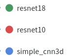
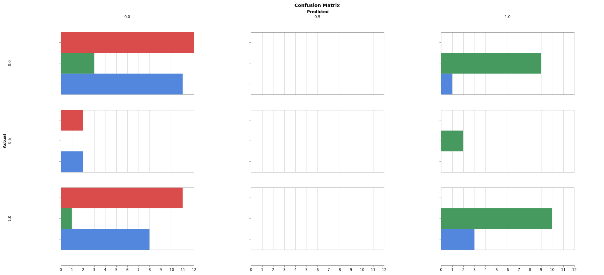

## Diamond Clarity Classification

There are 3 classes present in the dataset. Alost equal distribution.

## Installation

```bash
docker build -t dc .
./run_container.sh
```

Inside container, run

```python
python main.py
```

Inside `main.py` change `simple_cnn3d"` to either `resnet18` or `resnet10` on `line number 7`.

### Training

We use a lot of SOTA approaches like OneCycleLR, AdamW, FP16 training, Stratified splits for 90%-10% train val dataset, logging to wandb, augmentations using albumentation library. 

### Experiments

**CNN 3d**

- Resnet-18
- Resnet-10
- 6-layer simple cnn 3d architecture

Experiments can be tracked here : https://wandb.ai/dudeperf3ct/cnn3d

Analysis : Poor performance across all models. Performace is slightly better than random chance.

|  |  |
| :----------------------: | ---------------------------------- |


- We overfit the model with 3 samples, only `custom_simple_cnn3d` overfits the 3 samples of each class. Other 2 model fail to overfit.
- The depth is very small (6 in our case)
- CNN 3d focus only on spatial features
- Since we are training from scratch having more data is always helpful.
- The above confusion matrix shows that most models are predicting the majority of class to be `VS2`. 
- Models like`resnet18` have all predictions as one class
- `custom_simple_cnn3d` did not predict `SI1` class at all and same case with `resnet10` not predicting one class `SI2` at all.


​    

-----

**CNN 3d + LSTM**

-----

**CNN 3d + GRU**